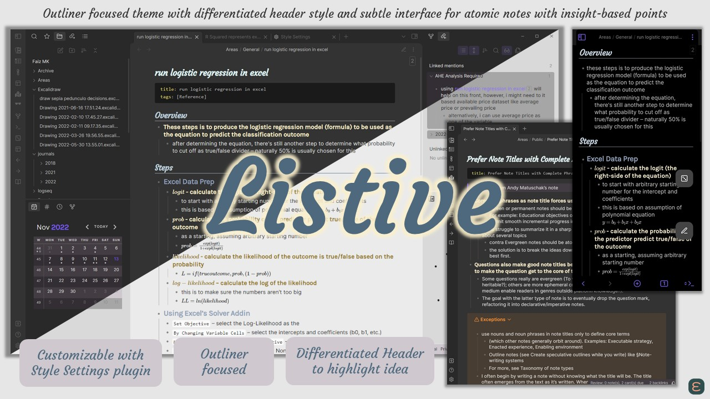

# Listive
> Outliner focused theme with differentiated header style and subtle interface for atomic notes with insight-based points

<!-- updated for v0.4.0 (draft) -->

  

<!-- old TOC
<table >
	<tr>
		<td align="center" colspan="5" style="padding:0.5em 0; border:none; ">Quick TOC:</td>
	</tr>
	<tr>
		<td style="padding:0.5em 1em; border: none; border-right: 1px solid DarkSlateGray">
			<a href="#guiding-principles">Guiding Principles</a>
		</td>
		<td style="padding:0 1em; border: none; border-right: 1px solid DarkSlateGray">
			<a href="#features">Features</a>
		</td>
		<td style="padding:0 1em; border: none; border-right: 1px solid DarkSlateGray">
			<a href="#companion-plugins">Companion Plugins</a>
		</td>
		<td style="padding:0 1em; border: none; border-right: 1px solid DarkSlateGray">
			<a href="#credits">Credits</a>
		</td>
		<td style="padding:0 1em; border: none; border-right: 1px solid DarkSlateGray">
			<a href="#support-me">Support Me</a>
		</td>
	</tr>
</table>
-->

Customisation I did for this theme (started off as a personal theme) are now optional / revert-able to cater for wider userbase. I follows this <a href="#guiding-principles">Guiding Principles</a>, and you may log a feature request as long as it doesn’t sway away for it.

Anyway, you might benefit more using this theme together with [Modular CSS Layout (MCL)](https://github.com/efemkay/obsidian-modular-css-layout) snippets for added functionality on multi columns, cards layout, gallery and image control.

### Table of Contents
- <a href="#guiding-principles">Guiding Principles</a>
- <a href="#features">Features</a>
- <a href="#companion-plugins">Companion Plugins</a>
- <a href="#supported-plugins">Supported Plugins</a>
- <a href="#credits">Credits</a>
- <a href="#support-me">Support Me</a>

## Guiding Principles
- **Focus on making outlining a better experience**
    - I aim to do that as much as CSS can do, and introduce customisation that are list-centric (especially for the plugins I use. See <a href="#supported-plugins">Supported Plugins</a>)
    - *But it doesn’t mean it doesn’t work for normal paragraph style writing – coz I still use for occasional paper write ups*
- **Make insights prominent with differentiated headers**
    - Each header level has different styling (by default) for a differentiated look to support [lead-in / action title](https://strategy-compass.com/en/action-titles-slides-headings/) style headers, focusing on the gist.
    - *But it can be reverted to original (or further customised) if so desire.*
- **Minimise distraction through subtle UI changes**
    - There will be (1) no hard lines (or borders) except for typography, and (2) minimal colors to be used for UI, focusing instead on shades. This is to minimise distraction but not to the extent of hiding default UI (like sidebar ribbon).

## Features

#### Differentiated Headers (customisable)
- Custom font and spacing for Headers in lists vs in normal paragraph
    - By default, pairing H1/H2, H3/H4 and H5/H6
    - Custom spacing for Headers mainly for Reading View

#### Color Schemes
- Currently there's only color scheme i.e. Base (grayscale) and Discord. You can change it via Style Settings

#### List-related Features
- **List Embed for "clean" embed in lists**
	- Two options to use List Embed -- per embed basis or global/vault wide. For Live Preview use, it's still experimental, and you able to adjust the positioning via Style Settings.
	- For per embed basis, put `list-embed` in the alias part e.g. `![[Why I Use Obsidian|list-embed]]`
	- For vault wide, enable the "Enable List Embed vault-wide" option via Style Settings
- **List bullet styling options**
	- Options among (1) disc only (default), (2) alternating disc-circle, and sequential disc-circle-square. Change via Style Settings

#### Custom Dataview Styling via Callout
- Use callout metadata `dv-list-nav` e.g. `[!blank-container|dv-list-nav]` to display dataview list in a button like style

#### Auxiliary Customisation
- **Callout styling**
	- “Icon on Top Right” as default, revert-able to original via Style Settings
	- `no-title` callout-metadata option (e.g. `> [!quote|no-title]`) for callout without title. Using this option will force styling to “Icon on Top Right”
- **Frontmatter compact styling.**
	- “Compact” styling as default (Reading View only). Revert-able to original via Style Settings
- Alignment for Mathjax / Latex in Lists – left (default), center, and right.
- Floating Action Button, adopted from [Obsidian You theme](https://github.com/selfire1/obsidian-you-theme)

### Planned Features
- [ ] Mermaid custom styling (especially Gantt chart)
- [ ] Multiple Table Design (alternate rows styling and perhaps first column)
- [ ] Different background for Journal (to have custom background in Reading View for section with specific header text)
- [ ] Adjustable position for FAB

> This theme is still work in progress. There are more features I have in mind -- those will be updated/released in due time.

## Companion Plugins
Listive works best with the following plugins installed to enable more complicated features and give more control to refine the look and feel.
- **Contextual Typography** plugin for advanced layout features such as custom spacing for 1st para/list.
- **Style Settings** plugin for refining the look and feel including choosing/creating custom color scheme.

## Supported Plugins
These are the plugins I use personally on frequent basis, and with that, I make some customisation for better UI
- Strange New World
- Query Control

## Credits
- [Obsidian You theme](https://github.com) for the FAB I adopted (because I find it very useful when using on a phone)

## Support Me
I do this on my free time for personal joy. However, a cup of coffee or two would motivate me further! If you like what I do, and want to contribute back, you can support me via Ko-fi

